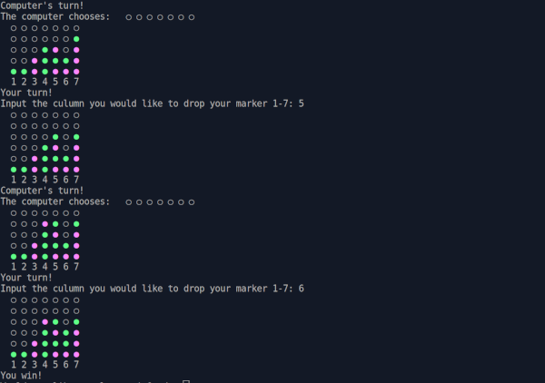

# Connect Four

## Project info

A command line Connect Four game where two players can play against each other. The purpose of this project was to practice Test Driven Development (TDD) with RSpec.

Project description can be found [here](https://www.theodinproject.com/lessons/ruby-connect-four).

## Live demo

Live demo available [on Replit (account required)](https://replit.com/@jcampbell57/Connect-Four#main.rb)

## Table of Contents

* [Features](#features)
* [Technologies utilized](#technologies-utilized)
* [Learning outcomes](#learning-outcomes)
* [Project screenshot](#project-screenshot)
* [Behind the Scenes](#behind-the-scenes)
* [Installation](#installation)

## Features

- Play multiplayer or singleplayer against the computer.
- Interactive gameplay allowing two players to take turns.
- Board display to visualize the game state.
- Validation of player moves to ensure they are within the valid range and the chosen column is not full.
- Detection of winning combinations to determine the winner.

## Technologies utilized

- Ruby
- RSpec

## Learning outcomes

This project helped to reinforce the following skills:

- Test Driven Development (TDD)
- Object Oriented Programming (OOP)
- basic Ruby knowledge

## Project screenshot

## Behind the scenes

### Project notes

- Run `rspec` to run tests
- I think I might have written too many tests. I could see the benefit to having minimal tests that focus on the most important things. 

### Resources

- For board design, I was inspired by [this example](https://replit.com/@thantko20/Connect-Four#main.rb).

## Installation

- Clone this repository to your desktop.
- Navigate to the top level of the directory by running `cd ruby_connect_four`.
- Run `ruby main.rb` in your terminal.
